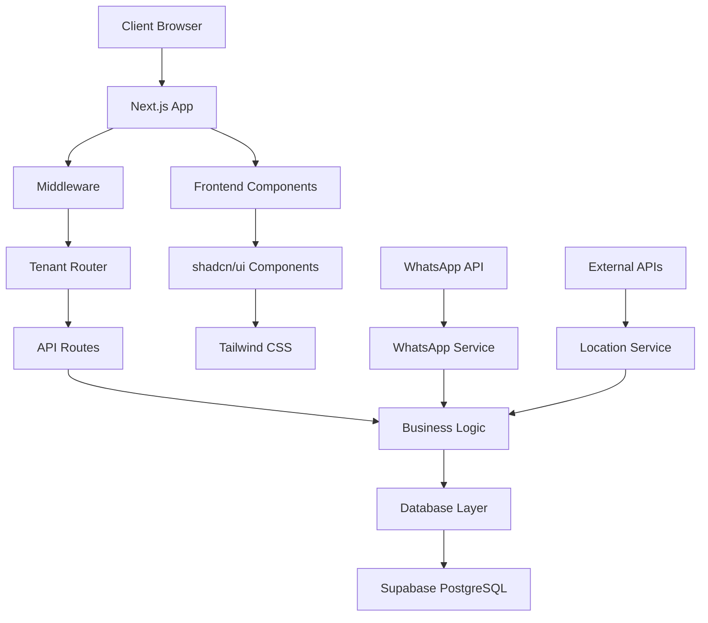
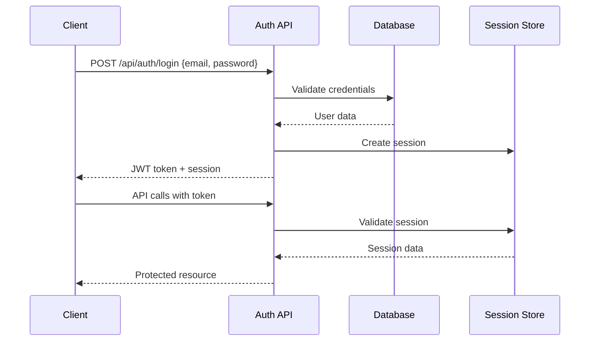
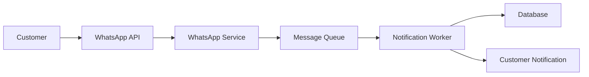

# 📚 Booqing Platform Documentation

## 📋 Table of Contents

1. [Overview](#overview)
2. [Architecture](#architecture)
3. [Setup & Installation](#setup--installation)
4. [Database Schema](#database-schema)
5. [API Documentation](#api-documentation)
6. [Frontend Components](#frontend-components)
7. [Authentication & Security](#authentication--security)
8. [Multi-Tenant System](#multi-tenant-system)
9. [WhatsApp Integration](#whatsapp-integration)
10. [Migration Guide](#migration-guide)
11. [Development Guidelines](#development-guidelines)
12. [Deployment](#deployment)

---

## 🌟 Overview

**Booqing** adalah platform multi-tenant booking profesional yang dikembangkan dengan teknologi modern untuk mendukung bisnis Indonesia dalam mengelola reservasi, pembayaran, dan komunikasi WhatsApp.

### 🎯 Key Features

- **Multi-Tenant Architecture**: Subdomain-based tenant isolation
- **Advanced Booking System**: Real-time availability dan home visit support
- **WhatsApp Integration**: Automated notifications dan customer communication
- **Financial Management**: Complete invoice dan payment tracking
- **Analytics Dashboard**: Comprehensive business insights
- **Role-Based Access Control**: Multi-level user permissions

### 🛠️ Tech Stack

- **Frontend**: Next.js 15 + React 19 + TypeScript
- **Backend**: Next.js API Routes + Server Components
- **Database**: PostgreSQL + Drizzle ORM + Supabase
- **UI**: Tailwind CSS + shadcn/ui + Radix UI
- **Authentication**: JWT-based dengan session management
- **Deployment**: Vercel-optimized

---

## 🏗️ Architecture

### System Architecture Overview



### Project Structure

```
booqing-platform/
├── app/                    # Next.js App Router
│   ├── api/               # API Routes
│   │   ├── admin/         # Admin endpoints
│   │   ├── auth/          # Authentication
│   │   ├── bookings/      # Booking management
│   │   ├── customers/     # Customer management
│   │   ├── financial/     # Financial endpoints
│   │   └── whatsapp/      # WhatsApp integration
│   ├── admin/             # Admin dashboard pages
│   ├── s/[subdomain]/     # Tenant-specific pages
│   └── layout.tsx         # Root layout
├── components/            # Reusable components
│   ├── ui/               # shadcn/ui components
│   ├── admin/            # Admin components
│   ├── booking/          # Booking-specific components
│   └── dashboard/        # Dashboard components
├── lib/                  # Business logic & utilities
│   ├── auth/             # Authentication logic
│   ├── database/         # Database configuration
│   └── [service]/        # Service modules
├── types/                # TypeScript type definitions
└── docs/                 # Documentation
```

---

## 🚀 Setup & Installation

### Prerequisites

- **Node.js**: 18.17.0 or higher
- **pnpm**: Latest version (recommended)
- **Supabase**: Account dan PostgreSQL database
- **Environment Variables**: Configuration file

### Installation Steps

#### 1. Clone Repository

```bash
git clone <repository-url>
cd booqing-platform
```

#### 2. Install Dependencies

```bash
pnpm install
```

#### 3. Environment Configuration

Copy dan sesuaikan environment variables:

```bash
cp .env.example .env.local
```

**Required Environment Variables:**

```env
# Database
DATABASE_URL="postgresql://[project_ref]:[password]@[project_ref].supabase.co:5432/postgres"
NEXT_PUBLIC_SUPABASE_URL="https://[project_ref].supabase.co"
NEXT_PUBLIC_SUPABASE_ANON_KEY="your_anon_key"

# Authentication
JWT_SECRET="your-super-secret-jwt-key"
SESSION_SECRET="your-session-secret"

# Application
NEXTAUTH_URL="http://localhost:3000"
NEXTAUTH_SECRET="your-nextauth-secret"
ROOT_DOMAIN="localhost:3000"

# WhatsApp (Optional)
WHATSAPP_API_KEY="your-whatsapp-api-key"
WHATSAPP_WEBHOOK_SECRET="your-webhook-secret"
```

#### 4. Database Setup

```bash
# Generate migration files
pnpm db:generate

# Push schema ke database
pnpm db:push

# Optional: Open Drizzle Studio
pnpm db:studio
```

#### 5. Start Development Server

```bash
pnpm dev
```

Access aplikasi:
- **Main Site**: http://localhost:3000
- **Admin Panel**: http://localhost:3000/admin
- **Tenant Example**: http://[tenant].localhost:3000

---

## 🗄️ Database Schema

### Core Tables

#### Tenants
```sql
CREATE TABLE tenants (
  id UUID PRIMARY KEY DEFAULT gen_random_uuid(),
  subdomain TEXT NOT NULL UNIQUE,
  business_name TEXT NOT NULL,
  owner_name TEXT NOT NULL,
  email TEXT NOT NULL,
  phone TEXT NOT NULL,
  subscription_plan TEXT DEFAULT 'basic',
  features JSONB,
  created_at TIMESTAMP DEFAULT NOW(),
  updated_at TIMESTAMP DEFAULT NOW()
);
```

#### Services
```sql
CREATE TABLE services (
  id UUID PRIMARY KEY DEFAULT gen_random_uuid(),
  tenant_id UUID REFERENCES tenants(id) ON DELETE CASCADE,
  name TEXT NOT NULL,
  description TEXT NOT NULL,
  duration INTEGER NOT NULL,
  price REAL NOT NULL,
  category TEXT NOT NULL,
  is_active BOOLEAN DEFAULT true,
  home_visit_available BOOLEAN DEFAULT false
);
```

#### Bookings
```sql
CREATE TABLE bookings (
  id UUID PRIMARY KEY DEFAULT gen_random_uuid(),
  tenant_id UUID REFERENCES tenants(id) ON DELETE CASCADE,
  customer_id UUID REFERENCES customers(id) ON DELETE CASCADE,
  service_id UUID REFERENCES services(id) ON DELETE CASCADE,
  status TEXT DEFAULT 'pending',
  scheduled_at TIMESTAMP,
  is_home_visit BOOLEAN DEFAULT false,
  total_amount REAL NOT NULL
);
```

### Complete Schema

Untuk schema lengkap, lihat file:
- `lib/database/schema/index.ts` - Drizzle schema definitions
- `docs/database-schema.md` - Detailed documentation

---

## 📡 API Documentation

### Authentication Flow



### API Endpoints

#### Authentication (`/api/auth/`)

| Method | Endpoint | Description | Auth Required |
|--------|----------|-------------|--------------|
| POST | `/login` | User login | ❌ |
| POST | `/logout` | User logout | ✅ |
| POST | `/change-password` | Change password | ✅ |
| POST | `/reset-password` | Reset password | ❌ |

#### Bookings (`/api/bookings/`)

| Method | Endpoint | Description | Auth Required |
|--------|----------|-------------|--------------|
| GET | `/` | List bookings with filters | ✅ |
| POST | `/` | Create new booking | ✅ |
| GET | `/[id]` | Get booking details | ✅ |
| PUT | `/[id]` | Update booking | ✅ |
| DELETE | `/[id]` | Cancel booking | ✅ |
| GET | `/availability` | Check availability | ✅ |

#### Customers (`/api/customers/`)

| Method | Endpoint | Description | Auth Required |
|--------|----------|-------------|--------------|
| GET | `/` | List customers | ✅ |
| POST | `/` | Create customer | ✅ |
| GET | `/[id]` | Get customer details | ✅ |
| PUT | `/[id]` | Update customer | ✅ |
| GET | `/search` | Search customers | ✅ |
| GET | `/stats` | Customer statistics | ✅ |

### Request/Response Examples

#### Create Booking

```typescript
// POST /api/bookings
{
  "customerId": "uuid",
  "serviceId": "uuid", 
  "scheduledAt": "2024-01-15T10:00:00Z",
  "isHomeVisit": false,
  "notes": "Customer notes"
}

// Response
{
  "id": "booking-uuid",
  "status": "confirmed",
  "totalAmount": 150000,
  "customer": {...},
  "service": {...}
}
```

#### Check Availability

```typescript
// GET /api/bookings/availability?serviceId=uuid&date=2024-01-15

// Response
{
  "available": true,
  "timeSlots": [
    {"time": "09:00", "available": true},
    {"time": "10:00", "available": false},
    {"time": "11:00", "available": true}
  ]
}
```

---

## 🎨 Frontend Components

### Component Architecture

```typescript
// Base component structure
interface ComponentProps {
  // Props definition
}

export function ComponentName({ ...props }: ComponentProps) {
  // Component logic
  return (
    <div className="tailwind-classes">
      {/* Component JSX */}
    </div>
  );
}
```

### Key Components

#### Booking System

- **BookingCalendar**: Interactive calendar dengan availability
- **BookingDialog**: Modal untuk create/edit booking
- **TimeSlotPicker**: Time selection dengan smart availability
- **HomeVisitBookingManager**: Location-based booking

#### Dashboard Components

- **TenantDashboardLayout**: Main dashboard layout
- **BookingAnalytics**: Revenue dan booking metrics
- **CustomerOverview**: Customer statistics dan insights
- **ServicePerformance**: Service analytics

#### UI Components (shadcn/ui)

- **Button**: Customizable button dengan variants
- **Dialog**: Modal dialogs
- **DropdownMenu**: Accessible dropdown
- **Calendar**: Date picker
- **Form**: Form components dengan validation

### Styling Guidelines

```typescript
// Tailwind CSS usage
const buttonStyles = "bg-primary text-primary-foreground hover:bg-primary/90";

// Variants dengan class-variance-authority
const buttonVariants = cva("inline-flex items-center justify-center", {
  variants: {
    variant: {
      default: "bg-primary text-primary-foreground",
      destructive: "bg-destructive text-destructive-foreground",
      outline: "border border-input bg-background",
    },
    size: {
      default: "h-10 px-4 py-2",
      sm: "h-9 rounded-md px-3",
      lg: "h-11 rounded-md px-8",
    },
  },
});
```

---

## 🔐 Authentication & Security

### Authentication Flow

1. **Login Process**
   - User submits email/password
   - Validate against database
   - Create JWT token
   - Store session in database
   - Return token to client

2. **Token Validation**
   - Middleware validates token on each request
   - Check session existence and expiry
   - Extract user context for authorization

### Security Features

#### Session Management

```typescript
interface UserSession {
  userId: string;
  tenantId: string;
  role: 'superadmin' | 'admin' | 'staff';
  permissions: string[];
  expiresAt: Date;
}

// Session validation middleware
export async function validateSession(token: string): Promise<UserSession | null> {
  const session = await getSession(token);
  if (!session || session.expiresAt < new Date()) {
    return null;
  }
  return session;
}
```

#### Role-Based Access Control (RBAC)

```typescript
// Permission definitions
const permissions = {
  'booking:create': ['admin', 'staff'],
  'booking:delete': ['admin'],
  'tenant:manage': ['superadmin'],
  'analytics:view': ['admin', 'superadmin'],
};

// Permission check
function hasPermission(userRole: string, permission: string): boolean {
  return permissions[permission]?.includes(userRole) || false;
}
```

#### Security Best Practices

- **Password Hashing**: bcrypt dengan salt rounds
- **Input Validation**: Zod schema validation
- **SQL Injection Prevention**: Drizzle ORM parameterized queries
- **XSS Prevention**: React's built-in escaping
- **Rate Limiting**: Per-endpoint rate limiting
- **Audit Logging**: All actions logged dengan timestamps

---

## 🏢 Multi-Tenant System

### Tenant Architecture

#### Subdomain Routing

```typescript
// middleware.ts
export function extractSubdomain(request: NextRequest): string | null {
  const host = request.headers.get('host') || '';
  
  // Local development
  if (host.includes('localhost')) {
    const parts = host.split('.');
    return parts.length > 1 ? parts[0] : null;
  }
  
  // Production
  const rootDomain = process.env.ROOT_DOMAIN;
  if (host.endsWith(rootDomain) && host !== rootDomain) {
    return host.replace(`.${rootDomain}`, '');
  }
  
  return null;
}
```

#### Tenant Isolation

```typescript
// Service layer tenant isolation
export class BookingService {
  async getBookings(tenantId: string, filters?: BookingFilters) {
    return await db.select()
      .from(bookings)
      .where(and(
        eq(bookings.tenantId, tenantId),
        // Add additional filters
      ));
  }
}
```

#### Tenant Customization

```typescript
interface TenantConfiguration {
  // Branding
  brandColors: {
    primary: string;
    secondary: string;
    accent: string;
  };
  logo?: string;
  
  // Features
  features: {
    whatsapp: boolean;
    homeVisit: boolean;
    analytics: boolean;
    customTemplates: boolean;
    multiStaff: boolean;
  };
  
  // Business settings
  businessHours: BusinessHoursSchedule;
  serviceAreas: ServiceArea[];
  currency: string;
  timezone: string;
}
```

---

## 📱 WhatsApp Integration

### Architecture Overview



### Features

#### Device Management

```typescript
interface WhatsAppDevice {
  id: string;
  tenantId: string;
  deviceName: string;
  phoneNumber: string;
  status: 'connected' | 'disconnected' | 'connecting';
  lastSeen: Date;
  qrCode?: string;
}
```

#### Message Templates

```typescript
interface MessageTemplate {
  id: string;
  tenantId: string;
  name: string;
  content: string;
  variables: string[];
  category: 'reminder' | 'confirmation' | 'promotion';
}

// Template usage example
const message = await renderTemplate('booking-reminder', {
  customerName: 'John Doe',
  serviceName: 'Hair Cut',
  appointmentTime: '2024-01-15T10:00:00Z',
});
```

#### Automation Rules

1. **Booking Confirmation**
   - Trigger: New booking created
   - Action: Send confirmation message

2. **Reminder System**
   - Trigger: 24 hours before appointment
   - Action: Send reminder message

3. **Follow-up**
   - Trigger: 1 day after service
   - Action: Send satisfaction survey

```typescript
// Automation service
export class WhatsAppAutomation {
  async onBookingCreated(booking: Booking) {
    await this.sendMessage(booking.customerId, 'booking-confirmation', {
      bookingId: booking.id,
      serviceName: booking.service.name,
      scheduledAt: booking.scheduledAt,
    });
  }
}
```

---

## 🔄 Migration Guide

### From Prisma to Drizzle ORM

#### Current Migration Status: **75% Complete**

#### Completed Migrations
- ✅ Database schema definitions
- ✅ Core authentication services
- ✅ Security audit logging
- ✅ User session management
- ✅ WhatsApp services
- ✅ Financial services

#### Pending Migrations

1. **Booking Service Migration**
   ```typescript
   // From Prisma
   const bookings = await prisma.booking.findMany({
     where: { tenantId },
     include: { customer: true, service: true }
   });
   
   // To Drizzle
   const bookings = await db.select({
     booking: bookings,
     customer: customers,
     service: services
   })
   .from(bookings)
   .leftJoin(customers, eq(bookings.customerId, customers.id))
   .leftJoin(services, eq(bookings.serviceId, services.id))
   .where(eq(bookings.tenantId, tenantId));
   ```

2. **Customer Service Migration**
3. **Service Management Migration**
4. **Location Service Migration**
5. **Settings Service Migration**

### Migration Steps

#### Step 1: Update Imports

```typescript
// Before
import { prisma } from '@/lib/database-prisma';

// After  
import { db } from '@/lib/database/server';
import { bookings, customers } from '@/lib/database/schema';
import { eq, and } from 'drizzle-orm';
```

#### Step 2: Convert Queries

```typescript
// Prisma query
const result = await prisma.tenant.findMany({
  where: {
    createdAt: { gte: startDate },
    isActive: true
  },
  include: { services: true }
});

// Drizzle equivalent
const result = await db.select({
  tenant: tenants,
  services: services
})
.from(tenants)
.leftJoin(services, eq(tenants.id, services.tenantId))
.where(and(
  gte(tenants.createdAt, startDate),
  eq(tenants.isActive, true)
));
```

#### Step 3: Update Type Definitions

```typescript
// Use Drizzle inferred types
import { InferSelectModel } from 'drizzle-orm';
import { tenants } from '@/lib/database/schema';

type Tenant = InferSelectModel<typeof tenants>;
```

---

## 📋 Development Guidelines

### Code Standards

#### TypeScript

```typescript
// Use strict TypeScript settings
// Prefer interfaces over types for objects
interface BookingData {
  id: string;
  customerId: string;
  // Use proper types
  scheduledAt: Date; // not string
  isHomeVisit: boolean; // not any
}

// Use generics for reusable functions
function createApiResponse<T>(data: T, success = true) {
  return {
    success,
    data,
    timestamp: new Date().toISOString(),
  };
}
```

#### Error Handling

```typescript
// Create custom error classes
class ValidationError extends Error {
  constructor(
    message: string,
    public fields?: Record<string, string[]>
  ) {
    super(message);
    this.name = 'ValidationError';
  }
}

// Use Result pattern for operations
type Result<T, E = Error> = 
  | { success: true; data: T }
  | { success: false; error: E };

async function createBooking(data: BookingData): Promise<Result<Booking>> {
  try {
    const validation = validateBookingData(data);
    if (!validation.isValid) {
      return { 
        success: false, 
        error: new ValidationError('Invalid data', validation.errors) 
      };
    }
    
    const booking = await db.insert(bookings).values(data).returning();
    return { success: true, data: booking[0] };
  } catch (error) {
    return { success: false, error: error as Error };
  }
}
```

#### API Response Format

```typescript
// Standard API response
interface ApiResponse<T = any> {
  success: boolean;
  data?: T;
  error?: {
    code: string;
    message: string;
    details?: any;
  };
  pagination?: {
    page: number;
    limit: number;
    total: number;
    totalPages: number;
  };
  timestamp: string;
}
```

### File Organization

#### Service Pattern

```typescript
// lib/booking/booking-service.ts
export class BookingService {
  // CRUD operations
  async create(data: CreateBookingData): Promise<Booking> { }
  async findById(id: string): Promise<Booking | null> { }
  async update(id: string, data: UpdateBookingData): Promise<Booking> { }
  async delete(id: string): Promise<void> { }
  
  // Business logic
  async checkAvailability(serviceId: string, date: Date): Promise<TimeSlot[]> { }
  async confirmBooking(id: string): Promise<Booking> { }
  async cancelBooking(id: string, reason?: string): Promise<Booking> { }
}
```

#### API Route Pattern

```typescript
// app/api/bookings/route.ts
import { NextRequest, NextResponse } from 'next/server';
import { bookingService } from '@/lib/booking/booking-service';
import { validateSession } from '@/lib/auth/session-store';

export async function GET(request: NextRequest) {
  try {
    const session = await validateSession(request);
    if (!session) {
      return NextResponse.json(
        { error: 'Unauthorized' }, 
        { status: 401 }
      );
    }

    const { searchParams } = new URL(request.url);
    const bookings = await bookingService.getBookings(session.tenantId, {
      // Parse filters
    });

    return NextResponse.json({
      success: true,
      data: bookings,
      timestamp: new Date().toISOString(),
    });
  } catch (error) {
    console.error('Bookings API error:', error);
    return NextResponse.json(
      { 
        success: false,
        error: {
          code: 'INTERNAL_ERROR',
          message: 'Failed to fetch bookings'
        }
      },
      { status: 500 }
    );
  }
}
```

---

## 🚀 Deployment

### Vercel Deployment

#### Environment Variables Setup

```bash
# Production environment
DATABASE_URL="postgresql://..."
NEXT_PUBLIC_SUPABASE_URL="https://..."
NEXT_PUBLIC_SUPABASE_ANON_KEY="..."
JWT_SECRET="..."
NEXTAUTH_URL="https://your-domain.com"
ROOT_DOMAIN="your-domain.com"
```

#### Build Configuration

```typescript
// next.config.ts
/** @type {import('next').NextConfig} */
const nextConfig = {
  output: 'standalone',
  experimental: {
    serverComponentsExternalPackages: ['pg'],
  },
  env: {
    CUSTOM_KEY: process.env.CUSTOM_KEY,
  },
};

export default nextConfig;
```

#### Subdomain Configuration

1. **DNS Setup**
   ```
   *.yourdomain.com -> CNAME -> cname.vercel-dns.com
   ```

2. **Vercel Configuration**
   ```json
   {
     "domains": ["yourdomain.com", "*.yourdomain.com"]
   }
   ```

### Database Migration

```bash
# Generate production migration
pnpm db:generate

# Apply to production database
pnpm db:push --prod
```

### Monitoring & Analytics

#### Vercel Analytics
- Built-in performance monitoring
- Real user metrics
- Error tracking

#### Custom Monitoring

```typescript
// lib/monitoring/performance-monitor.ts
export class PerformanceMonitor {
  static trackApiCall(endpoint: string, duration: number) {
    // Log performance metrics
  }
  
  static trackError(error: Error, context: any) {
    // Log errors dengan context
  }
}
```

---

## 📞 Support & Resources

### Documentation
- [Database Schema](./database-schema.md)
- [API Reference](./api-reference.md)
- [Component Library](./component-library.md)

### Development Tools
- Drizzle Studio: `pnpm db:studio`
- Development server: `pnpm dev`
- Build: `pnpm build`

### Getting Help

1. **Check logs**: Review console logs dan error messages
2. **Database validation**: Use Drizzle Studio untuk inspect data
3. **API testing**: Use Postman atau curl untuk test endpoints
4. **Performance**: Use Vercel Analytics untuk monitoring

### Version History

- **v2.0.0**: Migration ke Drizzle ORM + Supabase
- **v1.5.0**: WhatsApp integration
- **v1.0.0**: Initial multi-tenant architecture

---

*Terakhir diperbarui: 15 Oktober 2024*
